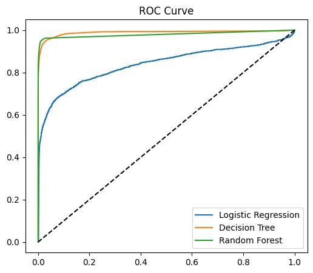
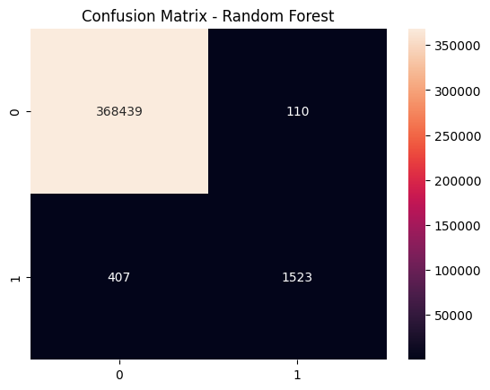

# 💳 Credit Card Fraud Detection System

A Machine Learning-based web application that detects fraudulent credit card transactions using an interactive Streamlit dashboard.

---

## 📌 Project Overview

This project predicts whether a transaction is **fraudulent or legitimate** based on key transaction features.  
It combines data preprocessing, feature engineering, machine learning, and a real-time user interface.

---

## 🧠 Machine Learning Models Used

- Logistic Regression  
- Decision Tree Classifier  
- Random Forest Classifier ✅ (Final Model)

The Random Forest model was selected as the best model based on overall performance.

---

## ⚙️ Features Used

- 💰 Transaction Amount (`amt`)  
- ⏰ Transaction Hour (`hour`)  
- 🛒 Transaction Category (`category`)  
- 👤 Customer Age (`age`)  
- 📍 Distance from Merchant (`distance_km`)  

---

## 📊 Model Performance

| Model               | Accuracy | F1 Score | ROC-AUC |
|--------------------|----------|----------|--------|
| Logistic Regression | 0.994     | 0.00     | 0.84   |
| Decision Tree       | 0.998     | 0.83    | 0.989   |
| Random Forest       | **0.998** | **0.854** | **0.979** |

> ⚠️ Replace these values with your actual results if needed

---

## 📈 Visualizations

### 🔹 ROC Curve

### 🔹 Confusion Matrix

---

## 🖥️ Streamlit Web Application

The web app allows users to:

- Enter transaction details  
- Get real-time fraud prediction  
- View probability and result instantly  

---

## 📁 Project Structure

credit-card-fraud-detection/ 
│ 
├── app.py 
├── model.pkl 
├── encoder.pkl 
├── roc_curve.png 
├── confusion_matrix.png 
├── README.md

---

## 🎯 Example Inputs

### ✅ Legitimate Transaction
- Amount: 50  
- Hour: 14  
- Category: food  
- Age: 30  
- Distance: 2  

### ⚠️ Fraudulent Transaction
- Amount: 2000  
- Hour: 2  
- Category: travel  
- Age: 22  
- Distance: 50  

---

## 🔍 Key Insights

- High transaction amounts increase fraud probability  
- Late-night transactions are more suspicious  
- Large distance indicates unusual behavior  
- Certain categories have higher fraud risk  

---

## 🛠️ Technologies Used

- Python  
- Pandas & NumPy  
- Scikit-learn  
- Streamlit  
- Matplotlib & Seaborn  

---

## 📌 Future Improvements

- Deploy using FastAPI backend  
- Add real-time fraud monitoring  
- Improve model using deep learning  
- Enhance UI/UX  

---
🌐 Live Demo

👉 Click here to try the app:

https://credit-card-fraud-detection-axrax9gkryqu3bgnw7axx4.streamlit.app/
